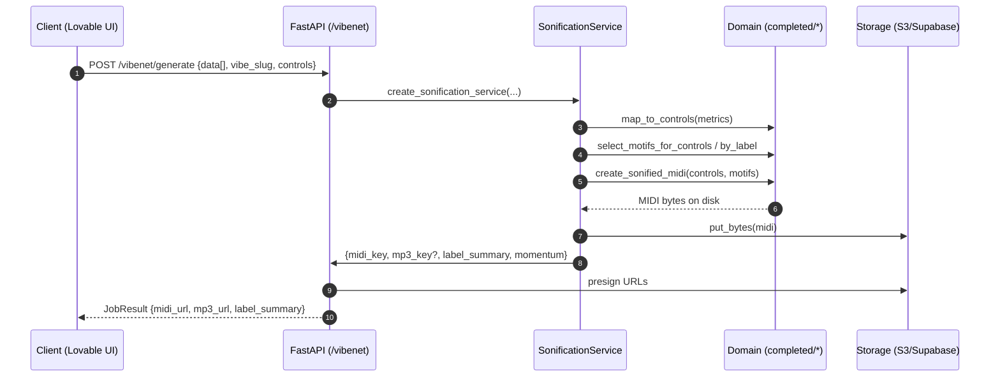
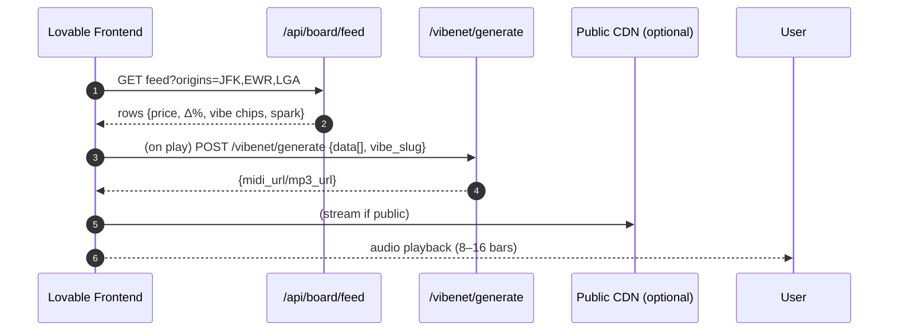

# VibeNet Sequence Diagrams

This document traces key request→artifact paths and UI interactions. Diagrams use Mermaid syntax for portability.

## 1) Data → Sonification Job (/vibenet/generate)



Notes:
- MP3 is optional (RENDER_MP3=1 + fluidsynth/ffmpeg available). Otherwise return MIDI URL only.

## 2) Board Playback (Home/Deals)



## 3) Notification → Board Badge

```mermaid
sequenceDiagram
  autonumber
  participant CR as Cron/Edge
  participant DB as Supabase
  participant API as /api/board/feed
  participant UI as Lovable Frontend

  CR->>DB: compute deltas/slope/window; insert notification_events
  UI->>API: GET board/feed
  API->>DB: fetch rows + recent events
  API-->>UI: feed with badges {PRICE_DROP, WINDOW_OPEN}
  UI-->>User: visual badges, optional audio flair
```

## 4) Local Remix (Electric Piano MIDI + Flights CSV)

```mermaid
sequenceDiagram
  autonumber
  participant CL as CLI (remix_midi_from_csv)
  participant M as completed/* + transform_midi
  participant FS as Filesystem

  CL->>CL: load CSV; derive metrics + bands + tempo
  CL->>M: select_motifs_for_controls; create_sonified_midi(base_template=<your.mid>)
  M-->>FS: write remixed .mid
  CL-->>User: output path + summary
```

